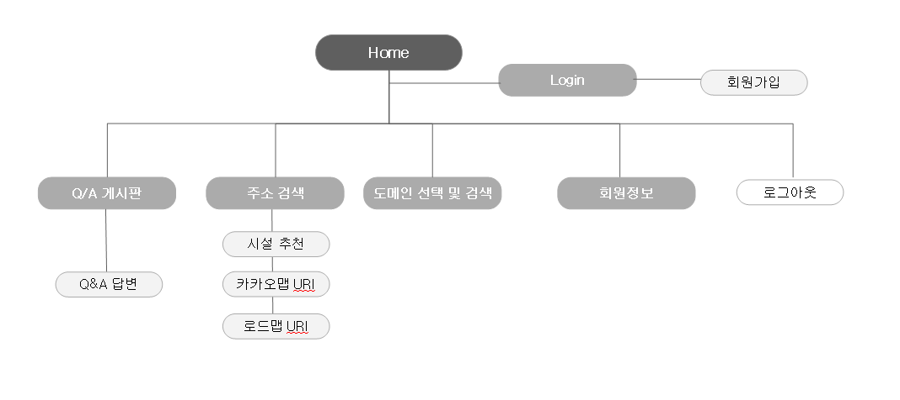
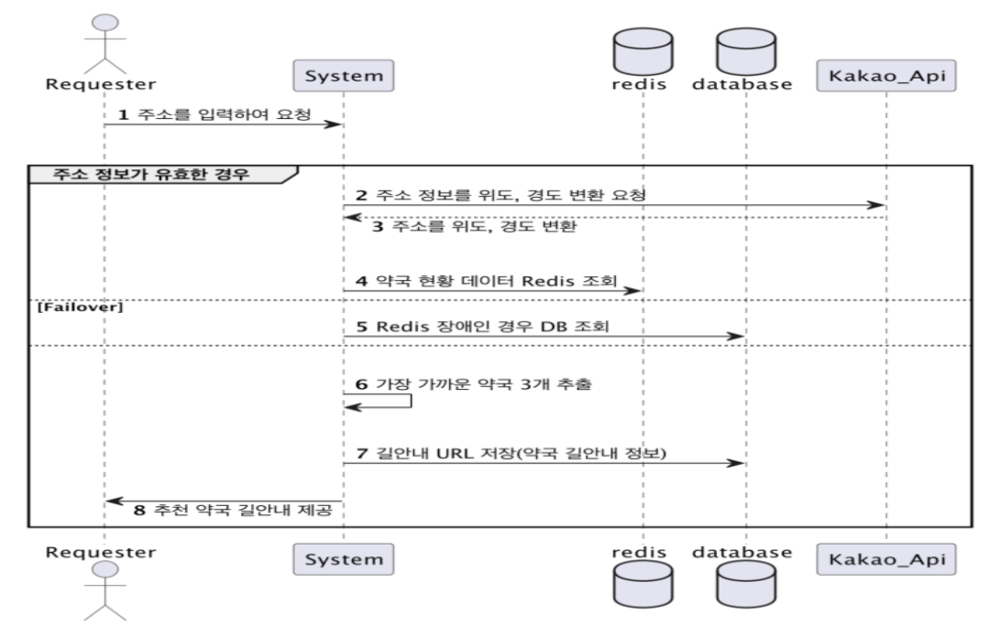
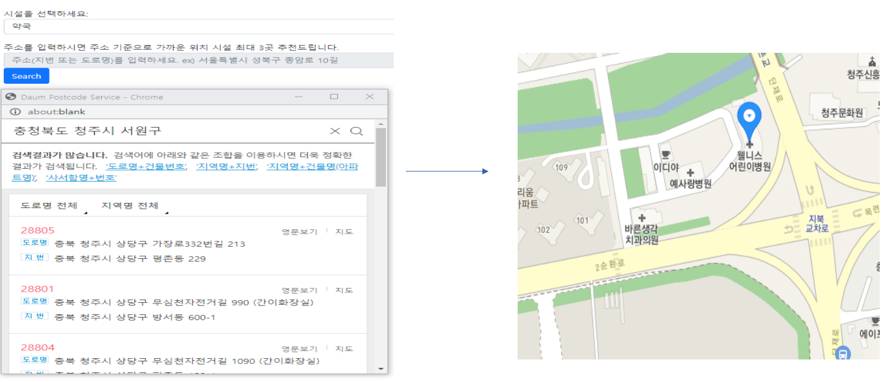
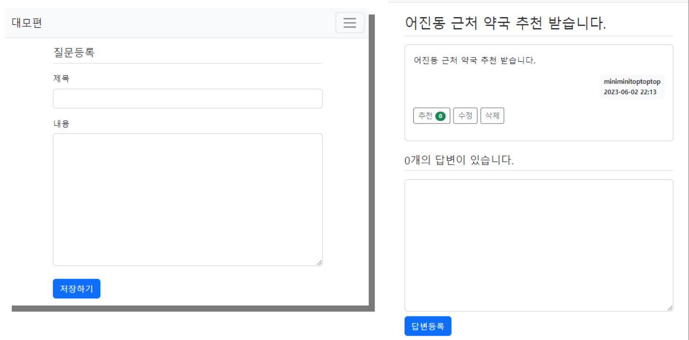
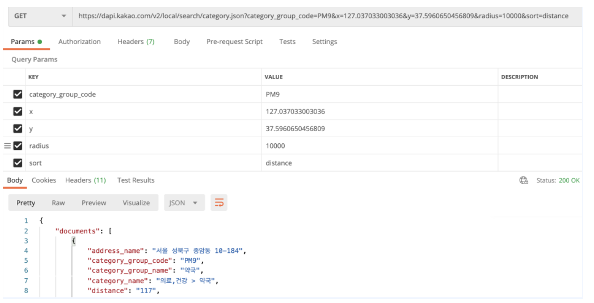

## 개발 프로젝트/ 편의시설 길 찾기 서비스

### 프로젝트 소개

- 프로젝트 이름 : 편의시설 길 찾기 웹 서비스
- 프로젝트 설명 : 사용자 위치에 가깝고 알맞은 편의시설을 카카오맵을 통해 제공
- 기술 스택 : SpringBoot, JDK, JPA, OpenAPI, MYSQL, SPOCK, mustache
- 사용 에디터 : IntelliJ
- 버전 관리 툴 : Git

## 화면 Architecture

## Recommendation Process

- 카카오 주소검색 API 연동하여 주소를 위도, 경도로 변환

- 공공데이터 포털로부터 시설 현황 데이터 추출

- Haversine formula 알고리즘을 통해 두 위도, 경도 사이의 거리 계산

- 추천 결과를 카카오 지도 URL로 연동하여 제공

- redis를 이용하여 성능 최적화

## 사용자 주소 입력 & 시설 위치 반환

## 추천 결과를 카카오 지도 URL로 연동하여 제공

## Q/A 게시판

## 동작 후기 및 고찰
개발 초기에는 공공데이터포털로의 openAPI에 접근해 편의시설에 대한 위도,경도에 대한 대량의 데이터들을 가져와 알고리즘을 적용해 
거리를 계산하여 가까운 거리의 시설 데이터 정보를 URI 형태로 제공하는 것을 기본 구조로 설계하였다.

하지만 추후에 카카오 API를 활용한 카테고리 검색이 서비스 시간적인 면과 DB를 활용하지 않아도 되는 장점이 있어 
카카오 API를 통해 사용자의 주소 정보를 위도,경도로 반환해 오는 방식으로 바꾸게 되었다.

### 카카오 API를 활용한 카테고리 검색
